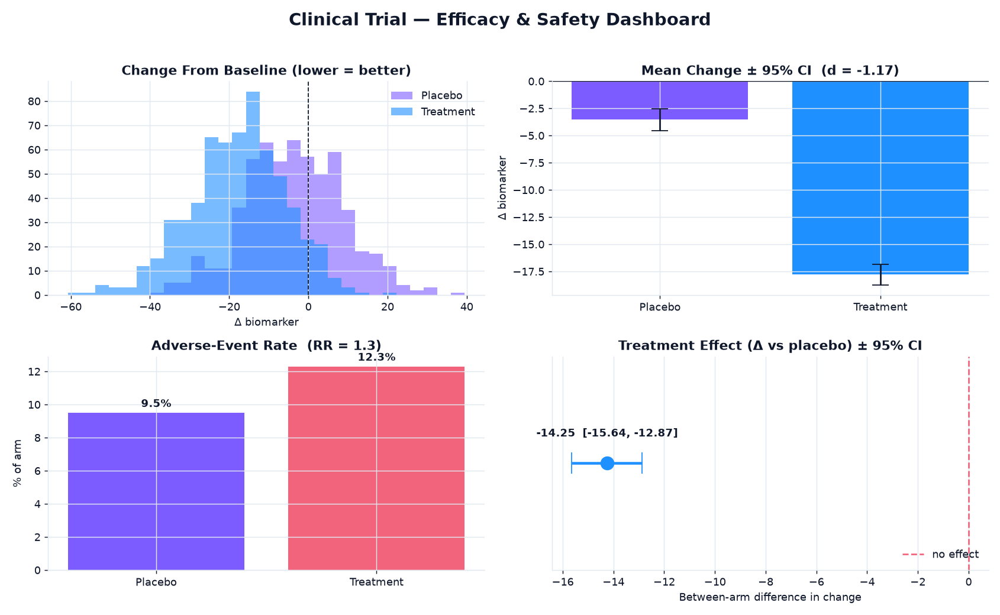

# 🧬 Clinical-Trial Analytics

> Efficacy and safety analysis of a synthetic two-arm clinical trial — the
> statistical reporting pattern used in clinical research (effect size, confidence
> intervals, hypothesis testing), expressed in **Python / pandas / SciPy**.

<p>
  
  
  
  
  
  
</p>

---

## 📊 Trial-results dashboard

Generated by `src/analyze.py` from 1,200 enrolled patients (Treatment vs Placebo):



---

## Why this project

A trial readout has to answer two questions before anyone reads the marketing: *did
the treatment work, and how much did it cost patients in safety?* Getting there
requires more than a p-value — you need the **effect size** (is it big enough to
matter?), a **confidence interval** (how sure are we?), and a **safety comparison**
that is honest about the risk trade-off. This project runs that full readout from
raw patient records: a governed statistics layer, a one-page results dashboard, and
plain-language findings a clinical lead could take into a review meeting.

## What it does

| Stage | File | Output |
|---|---|---|
| **Generate** a realistic two-arm trial (age/sex mix, baseline biomarker, seeded treatment effect, adverse events) | `src/generate_data.py` | `data/trial.csv` |
| **Test efficacy** — change from baseline, Welch's t-test, Cohen's d, 95% CI | `src/analyze.py → efficacy()` | `outputs/kpis.json` |
| **Test safety** — adverse-event rate, relative risk, chi-square | `src/analyze.py → safety()` | `outputs/kpis.json` |
| **Visualise** the one-page dashboard + standalone charts | `src/analyze.py → dashboard()` | `outputs/*.png` |
| **Explain** the numbers as plain-language findings | `src/analyze.py → insights()` | console |
| **Verify** invariants and statistical direction | `tests/test_analysis.py` | `pytest` |

## 📈 Headline results (latest run)

Primary endpoint — **change from baseline** (lower = greater biomarker reduction = better):

| Metric | Treatment | Placebo |
|---|---|---|
| Mean change | **−17.78** | −3.53 |
| Std dev | 12.03 | 12.38 |
| n | 619 | 581 |

| Statistic | Value |
|---|---|
| Between-arm difference | **−14.25** (95% CI [−15.64, −12.87]) |
| Effect size (Cohen's d) | **−1.17** (large) |
| Welch's t-test | t = −20.20, **p = 2.9 × 10⁻⁷⁸** |
| Verdict | **Statistically significant** (p < 0.05) |

Secondary endpoint — **safety**:

| Metric | Value |
|---|---|
| Adverse-event rate (Treatment) | **12.3%** |
| Adverse-event rate (Placebo) | 9.5% |
| Relative risk | 1.30 |
| Chi-square test | p = 0.14 — **not significant** |

> Full machine-readable results: [`docs/kpis.json`](docs/kpis.json). Numbers are
> deterministic (seeded RNG) — re-running reproduces them exactly.

## 🔍 Example insights (auto-generated)

- Treatment reduced the biomarker by **14.25 points more** than placebo (−17.78 vs −3.53), 95% CI [−15.64, −12.87].
- The effect is **large** (Cohen's d = −1.17) and highly significant (Welch t = −20.20, p = 2.9 × 10⁻⁷⁸).
- Safety signal is **modest**: 12.3% vs 9.5% adverse events (RR 1.30), not statistically significant (chi-square p = 0.14).
- Arms are **balanced**: 619 treatment / 581 placebo, mean age 54.4, 50.2% female.

## Methodology

- **Primary endpoint** — change from baseline (`followup − baseline`), compared
  between arms with **Welch's t-test** (does not assume equal variances, the safer
  default for real trial data).
- **Effect size** — **Cohen's d** on the pooled standard deviation, so a
  significant result is also reported as *how large*. d ≈ 1.17 clears Cohen's 0.8
  "large" threshold.
- **Confidence interval** — 95% CI on the between-arm difference using the
  Welch–Satterthwaite degrees of freedom; the interval excludes zero, which is the
  visual "forest plot" panel on the dashboard.
- **Safety** — adverse-event counts compared with a **chi-square test of
  independence** on the 2×2 contingency table, reported alongside **relative risk**.

## ▶️ Run it

```bash
pip install -r requirements.txt
python src/generate_data.py     # writes data/trial.csv
python src/analyze.py           # writes outputs/ (dashboard + charts + kpis.json)
pytest -q                       # 9 tests
```

## 🧪 Tests

`tests/test_analysis.py` guards what must never silently break: the schema and
value bounds (age 18–90, binary adverse-event flag), arm balance, and — critically
— the **statistical direction**: treatment must reduce the biomarker more than
placebo, the effect must be large (|d| ≥ 0.8), and its 95% CI must exclude zero.

## 🗂️ Project structure

```
healthcare-analytics/
├── src/
│   ├── generate_data.py   # synthetic two-arm trial generator (seeded)
│   └── analyze.py         # efficacy + safety stats engine + dashboard
├── tests/
│   └── test_analysis.py   # pytest invariants + statistical sanity
├── docs/                  # committed visuals + results snapshot + data sample
├── requirements.txt
└── README.md
```

## 🛠️ Stack

`pandas` · `numpy` · `scipy.stats` (Welch t-test, chi-square) · `matplotlib` · `pytest`

---

<sub>Part of my data & analytics portfolio — [github.com/syedjawaadali](https://github.com/syedjawaadali). Data is synthetic; no real patient data is used.</sub>
